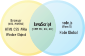

.. cssclass:: details

May 2020 / Version 1.0 / Various Authors [1]_

Getting started with a history, skill guide and how-to of web standards.
------------------------------------------------------------------------

Introduction
------------

The "web platform" is comprised of a collection of standardized :term:`application programming interfaces (APIs) <API>` that programmers use to make web pages and web applications.
This includes technologies, like HTML, CSS and JavaScript.
In addition to including a full implementation of the JavaScript programming language that web browsers share with Node.js, web browsers expose their own standardized :term:`APIs <API>` specifically made for interacting with web pages.

The web platform is powerful and expressive, but it's also a little broken in parts.
That's where the other part of the web platform comes in.
The term "web platform" *also* describes the people and practices that are meant to include everyone in improving the standard programming interfaces.
The web can only work if it's built with an understanding of all its constituents--the whole world!
This guide aims to help you participate in the continuing design of the web platform so that your perspective can help shape the direction of the web.

In this guide, we are going to focus on bugs in a web standard for browsers.
Bugs are a great way to get started because to get them fixed, you have to touch all of the components of a web standard; a specification, a patch to the source code of a browser engine, and interoperability tests.
You might be surprised by how working on browser bugs will get you moving into deep parts of the web platform!
Many of the most prolific contributors to the web platform got their start by working on interoperability bugs between browsers.

In the context of this guide, the goal of working on the web platform is to reach interoperability, not to add features, or change specs.
This is maintenance work, and it is the one of the most important things that the web needs.
In the `2019 MDN Developer Needs Assessment Report <https://insights.developer.mozilla.org/>`__,
interoperability is among the top pain points for web developers.

When interoperability is poor, it has several negative consequences:

* Web developers are taxed in time and frustration to work around the interoperability problem.
* End users that use a browser that the web developer didn't cater for has a worse experience.
* Browsers with minority user share are at disadvantage because many web developers only test in the current market leader, leaving their sites broken in other browsers, which creates incentive for users to switch browsers.
  This can ultimately lead to the minority browser to stop developing that browser's engine, resulting in less browser engine diversity.

Work towards improving interoperability can sometimes mean adding specification prose, writing tests, and filing bugs on browsers, but this can also mean deleting things, and writing negative tests to ensure that the feature is not in the browser.
All forms of this work are part of maintenance and we celebrate each kind of contribution.

Table of Contents
-----------------

.. toctree::
  :maxdepth: 2

  governance
  ipr
  skills
  bug-guide
  paths-for-growth
  case-studies
  interviews
  directory
  glossary

.. [1]
   Boaz Sender,
   Jory Burson,
   Leo Balter,
   Mike Pennisi,
   Simon Pieters,
   Valerie Young,
   future contributors here
